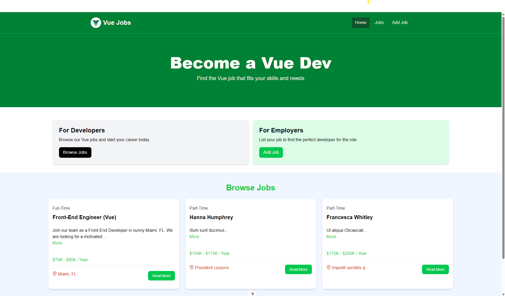

# vue-job-list

This a job listing project build with Vue JS



## Usage

This project uses JSON-Server for a mock backend

### Install Dependencies

```bash
npm install
```

### Run JSON Server

The server will run on http://localhost:8000

```bash
npm run server
```

### Run Vite Frontend

Vue will run on http://localhost:3000

```bash
npm run dev
```

# vue-job-list
